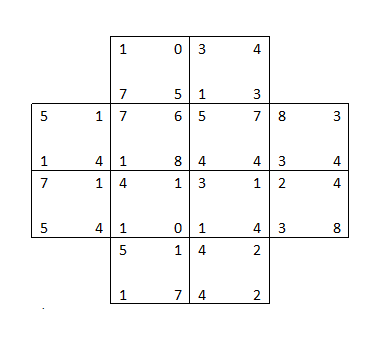
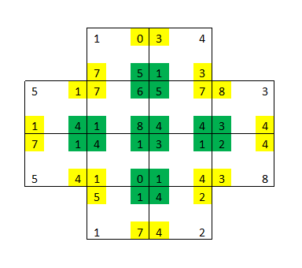
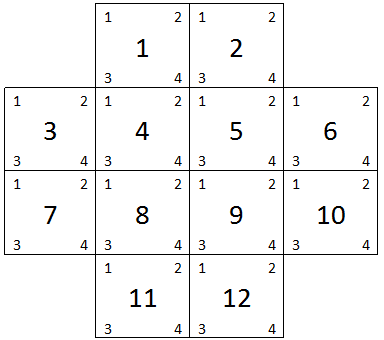

# 12 квадратов

Вкратце - даны квадраты с числами в углах, нужно замостить ими поле так, 
чтобы сумма чисел на стыке углов квадратов была равна 10, если их 4, и была меньше или равна 10, если их меньше.

<details>
  <summary>полное условие</summary>

Есть 12 квадратов с произвольными числами от 0 до 9 в углах. Квадраты расставлены следующим образом:



(числа в углах даны для примера, далее как пример №1)

Квадраты надо поменять местами таким образом, чтобы сумма чисел четырех соприкасающихся углов была равна 10 (подкрашено зеленым), 
а двух или трех углов - не более 10 (подкрашено желтым).



На входе текстовый файл, одна строка – четыре числа – значения углов одного квадрата. Порядок строк и чисел в строке следующий:



Для примера №1 файл имеет следующий вид:

```
1 0 7 5  
3 4 1 3  
5 1 1 4  
7 6 1 8  
5 7 4 4  
8 3 3 4  
7 1 5 4  
4 1 1 0  
3 1 1 4  
2 4 3 8  
5 1 1 7  
4 2 4 2
```

Окончательный результат перестановки выводится в консоль в том же формате. Если возможно несколько решений, то выводятся все решения, разделенные пустой строкой.

</details>

## Описание решения

Реализованы два варианта: 
1. Тупейший перебор: перебираются все размещения, для каждого проверяется, что все стыки имеют правильную сумму. 
2. Поиск с возвратом без оптимизаций: для каждого места на поле перебираются возможные квадраты, если при добавлении квадрата все его стыки корректны, то пробуем добавить следующий. 
 
В обоих вариантах поддерживаются другие варианты поля.

## Что еще можно было сделать:

Ввод-вывод сделан очень примитивно: вход практически не валидируется, в конце вывода всегда будет перенос строки и т.п. 

Есть простор для оптимизаций: в тупом переборе можно использовать несколько потоков (но параллельные коллекции не очень работают с итераторами), 
а в поиске с возвратом можно оптимизировать использование памяти (если хранить текущие значения в изменяемых коллекциях, а не в копиях), 
перебирать ячейки по более оптимальному порядку (от центра к краям), 
перебирать следующие квадраты жадным алгоритмом по возрастанию значений и ограничением по значению (с индексом на ДДП)
и тоже распараллелить. 
Однако поиск с возвратом и без оптимизаций на примере работает достаточно быстро.

Кроме того, стоит добавить больше негативных тестов.
